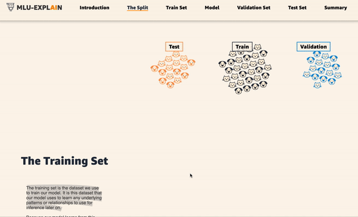
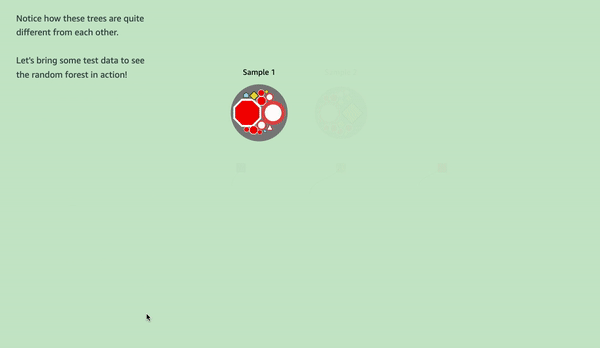
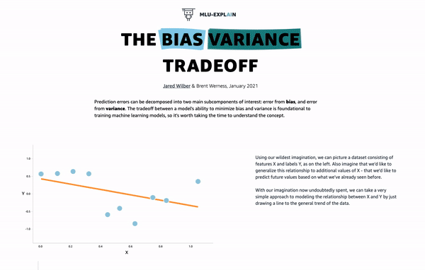

This repository holds the code used for Amazon's [MLU-Explain](https://mlu-explain.github.io/) educational articles on machine learning. MLU-Explain exists to illustrate core machine learning concepts using visual essays in a fun, informative, and accessible manner.

This material exists as supplementary educational material for [Machine Learning University (MLU)](https://aws.amazon.com/machine-learning/mlu/), which provides anybody, anywhere, at any time access to the same machine learning courses used to train Amazon’s own developers on machine learning.

# Articles

## Linear Regression


**Title**: [Linear Regression](https://mlu-explain.github.io/linear-regression/)

**Summary**: A visual, interactive explanation of linear regression for machine learning.

**Code**: [/code/linear-regression/](/code/linear-regression)

**Authors**: Jared Wilber

## Logistic Regression


**Title**: [Logistic Regression](https://mlu-explain.github.io/logistic-regression/)

**Summary**: Learn about how logistic regression can be used for binary classification through an interactive example.

**Code**: [/code/logistic-regression/](/code/logistic-regression)

**Authors**: Erin Bugbee, Jared Wilber

## ROC & AUC


**Title**: [ROC & AUC](https://mlu-explain.github.io/roc-auc/)

**Summary**: A visual explanation of the Receiver Operating Characteristic Curve (ROC) curve, how it works with a live interactive example, and how it relates to Area Under The Curve (AUC).

**Code**: [/code/roc-auc/](/code/roc-auc)

**Authors**: Jared Wilber

## Train, Test, And Validation Sets



**Title**: [Train, Test, and Validation Sets](https://mlu-explain.github.io/train-test-validation/)

**Summary**: Learn why it is best practice to split your data into training, testing, and validation sets, and explore the utility of each with a live machine learning model.

**Code**: [/code/train-test-validation/](/code/train-test-validation)

**Authors**: Jared Wilber, Brent Werness

## Precision & Recall


**Title**: [Precision & Recall](https://mlu-explain.github.io/precision-recall/)

**Summary**: When it comes to evaluating classification models, accuracy is often a poor metric. This article covers two common alternatives, Precision and Recall, as well as the F1-score and Confusion Matrices.

**Code**: [/code/precision-recall/](/code/precision-recall)

**Authors**: Jared Wilber

## Random Forest



**Title**: [Random Forest](https://mlu-explain.github.io/random-forest/)

**Summary**: Learn how the majority vote and well-placed randomness can extend the decision tree model to one of machine learning's most widely-used algorithms, the Random Forest.

**Code**: [/code/random-forest/](/code/random-forest)

**Authors**: Jenny Yeon, Jared Wilber

## Decision Trees


**Title**: [Decision Trees](https://mlu-explain.github.io/decision-tree/)

**Summary**: Explore one of machine learning's most popular supervised algorithms: the Decision Tree. Learn how the tree makes its splits, the concepts of Entropy and Information Gain, and why going too deep is problematic.

**Code**: [/code/decision-tree/](/code/decision-tree)

**Authors**: Jared Wilber, Lucía Santamaría

## Bias Variance Tradeoff



**Title**: [The Bias Variance Tradeoff](https://mlu-explain.github.io/bias-variance/)

**Summary**: Understand the tradeoff between under- and over-fitting models, how it relates to bias and variance, and explore interactive examples related to LASSO and KNN.

**Code**: [/code/bias-variance/](/code/bias-variance)

**Authors**: Jared Wilber, Brent Werness

## Double Descent: A Visual Introduction


**Title**: [Double Descent](https://mlu-explain.github.io/double-descent/)

**Summary**: Meet the double descent phenomenon in modern machine learning: what it is, how it relates to the bias-variance tradeoff, the importance of the interpolation regime, and a theory of what lies behind.

**Code**: [/code/double-descent/](/code/double-descent)

**Authors**: Jared Wilber, Brent Werness

## Double Descent 2: A Mathematical Explanation


**Title**: [Double Descent 2](https://mlu-explain.github.io/double-descent2/)

**Summary**: Deepen your understanding of the double descent phenomenon. The article builds on the cubic spline example introduced in Double Descent 1, describing in mathematical detail what is happening.

**Code**: [/code/double-descent2/](/code/double-descent2)

**Authors**: Brent Werness, Jared Wilber

## Running Locally

This article holds code for each articles, as well as the generated builds from the code (e.g. the static assets comprising the articles).

First, clone this repo.

```bash
git clone https://github.com/aws-samples/aws-mlu-explain.git
```

Next, cd into the article of interest and install the required libraries.

```bash
# e.g. bias variance tradeoff article
cd bias-variance
# install libraries
npm install
```

Now, to run the development version:

```bash
npm start
```

To build and view the static assests:

```bash
# build assets
npm run build
# view generated article
cd dist/
# run local server
python3 -m http.server # or just `live-server`
```

## License Summary

This open source articles are made available under the Creative Commons Attribution-ShareAlike 4.0 International License. See [LICENSE](LICENSE) file.

The sample and reference code within this open source book is made available under a modified MIT license. See the [LICENSE-SAMPLECODE](LICENSE-SAMPLECODE) file.
